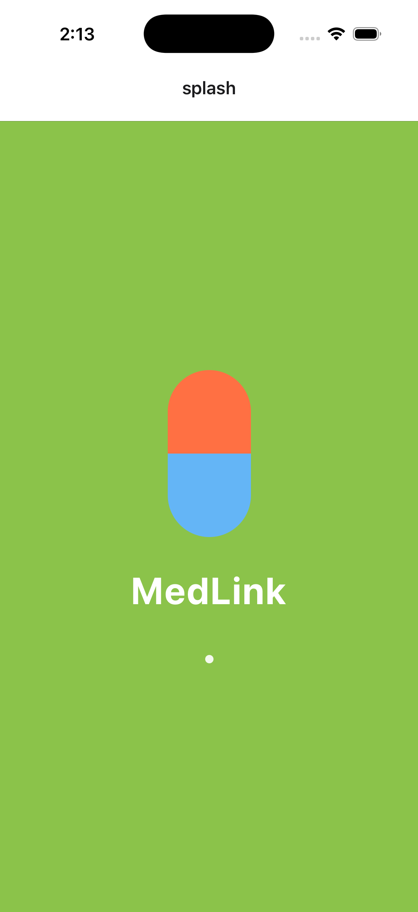
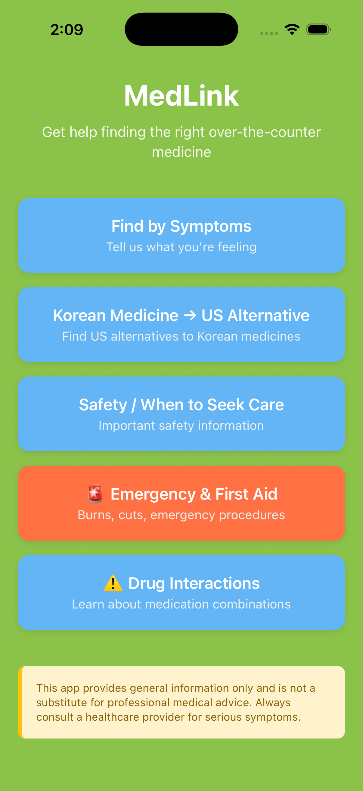
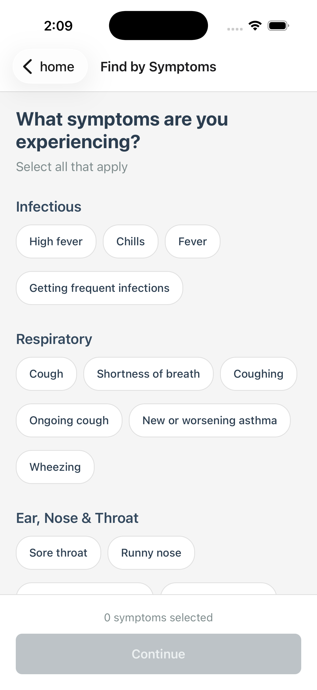
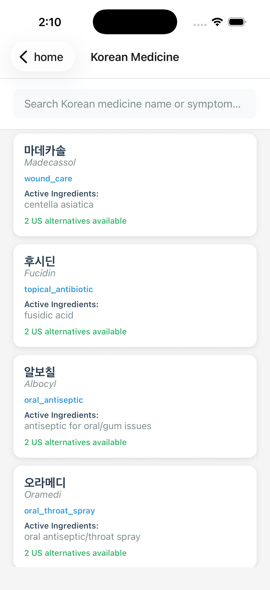
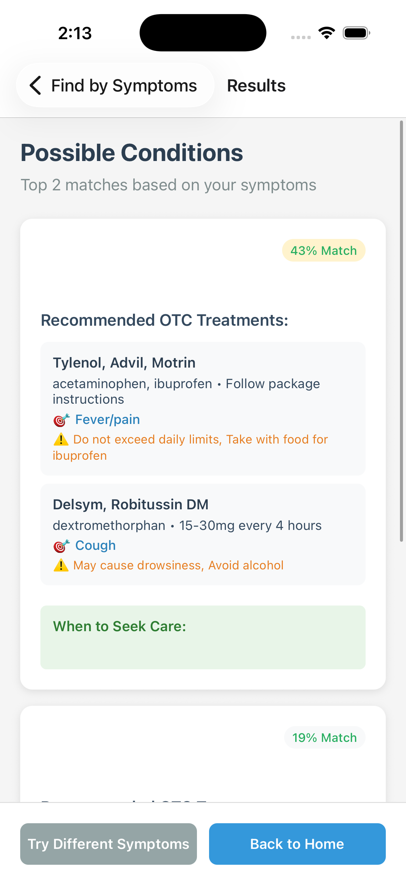

# 🩺 MedLink

MedLink is an iOS mobile application designed for Korean international students in the United States that helps users identify appropriate over-the-counter (OTC) medications based on symptoms and familiar Korean medicines.

---

## 📱 App Preview

  
  
  

  
  
  

---

## 📖 Background

Many Korean international students in the U.S. face challenges when navigating American pharmacies because:

- Medication brand names differ significantly from Korean products  
- Active ingredients are unfamiliar  
- It is difficult to confidently match Korean medicines to U.S. equivalents  

MedLink addresses this challenge by providing structured symptom-based recommendations and Korean-to-U.S. medication mapping in a clean, intuitive interface.

---

## 🛠 Tech Stack

- TypeScript
- React Native
- Expo
- Expo Router
- Node.js
- iOS Simulator (Development Build)

---

## 🚀 Key Features

### 1️⃣ Symptom-Based Guidance

Users select their current symptoms and receive:

- Possible condition categories  
- Suggested U.S. OTC medications  
- General safety guidance  

This helps users quickly narrow down appropriate non-prescription options available in U.S. pharmacies.

---

### 2️⃣ Korean Medicine → U.S. Alternative Matching

Users can select familiar Korean medicines and view:

- Active ingredients  
- Comparable U.S. OTC products  
- Availability context  

This feature bridges the knowledge gap between Korean and American pharmaceutical markets.

---

### 3️⃣ Safety & When to Seek Care

The app provides:

- Red-flag symptom awareness  
- Guidance on when to seek urgent care  
- Clear informational disclaimers  

---

### 4️⃣ Emergency & First Aid Reference

Quick reference guidance for:

- Minor burns  
- Cuts and injuries  
- Basic first-aid procedures  

---

### 5️⃣ Drug Interaction Awareness

Educational information about:

- Basic medication combination risks  
- The importance of checking active ingredients  

---

## 🧠 Development Note

I leveraged Claude as an AI coding assistant to accelerate prototyping and development.

I was responsible for:

- Product concept development  
- System architecture design  
- Feature implementation  
- UI/UX design decisions  
- Testing and debugging  

Claude was used strictly as a development tool, while overall system logic and product direction were independently designed and validated.

---

## 🔒 Ethical & Safety Considerations

MedLink is designed as an informational tool only.

- The application does **not** provide medical diagnosis or treatment.  
- Recommendations are general educational suggestions.  
- Users are explicitly advised to consult licensed healthcare professionals for serious, persistent, or emergency symptoms.  
- The app avoids definitive medical claims and includes clear safety disclaimers throughout the user experience.  

Healthcare-related software carries ethical responsibility. MedLink prioritizes clarity, transparency, and responsible communication to avoid misleading users.

---

## 🔮 Future Improvements

- Expand medication database coverage  
- Improve condition inference logic  
- Add bilingual (Korean/English) toggle  
- Implement pharmacy locator integration  
- Enhance medication safety validation  
- Introduce structured data-driven recommendation logic  

---

## 📌 Disclaimer

This application is intended for educational and informational purposes only.  
It does **not** provide medical advice, diagnosis, or treatment.

Always consult a licensed healthcare provider for professional medical guidance.
